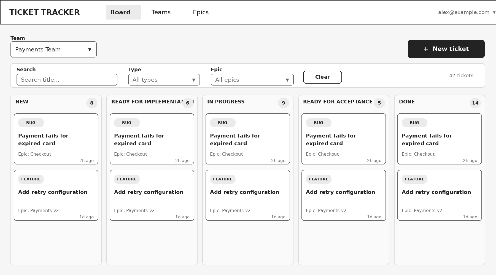
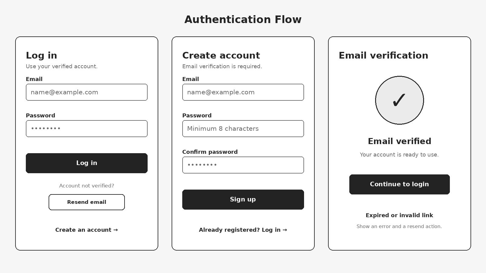
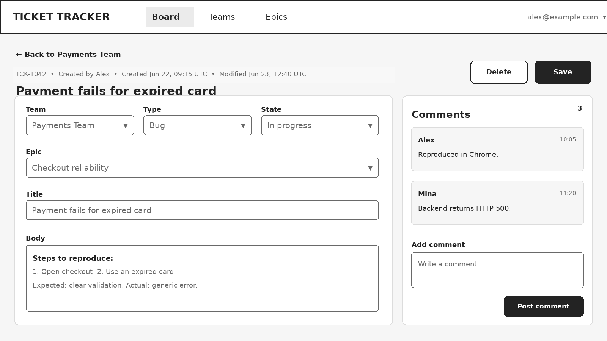
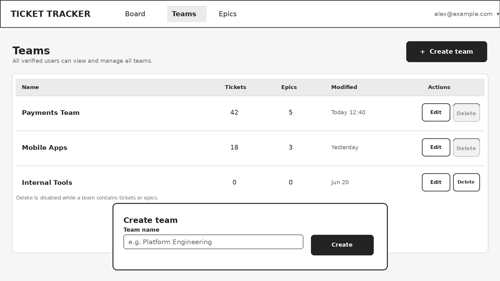

# Reference Wireframes

These low-fidelity wireframes are extracted from §15 of the requirements
specification (`Hackathon_Ticketing_System_Requirements_v3 1.docx`). They
illustrate the expected information hierarchy and primary user flows.

> They are **not a required visual design** — a different layout is acceptable as
> long as all mandatory actions and states remain clear and usable. The collapsed
> user menu shown in the header is expected to include **Log out**. Disabled
> delete controls indicate records that cannot currently be deleted because they
> are referenced.

The five screens map to the minimum screens in §10 of the spec and the frontend
feature modules in [`../../architecture.md`](../../architecture.md) §4.

---

## Wireframe 1 — Kanban board (primary screen)

Team selector, **New ticket** action, and the type/epic filters plus title search.
Five fixed state columns (`New`, `Ready for implementation`, `In progress`,
`Ready for acceptance`, `Done`) with draggable cards showing type, title, and epic.
Maps to the `board` feature.

## Wireframe 2 — Login, sign-up, and email verification

The three public auth screens: log in (with a **Resend email** action for
unverified accounts), create account (min 8-char password, confirm password), and
the email-verification result (verified → continue to login; expired/invalid →
error + resend). Maps to the `auth` feature.

## Wireframe 3 — Ticket details, editing, and comments

Editable team / type / state / epic / title / body fields with created-by and
created/modified timestamps, **Save** and **Delete** (confirmed) actions, and a
chronological comments panel with an add-comment box. Maps to the `ticket-detail`
feature.

## Wireframe 4 — Team management

Team list with ticket/epic counts and modified date, create/edit/delete actions,
and a create-team form. Delete is disabled while a team contains tickets or epics
(HTTP 409 on the API). Maps to the `teams` feature.

## Wireframe 5 — Epic management

Per-team epic list with ticket counts, plus a create/edit form (title + optional
description). Delete is disabled while tickets reference the epic (HTTP 409 on the
API). Maps to the `epics` feature.
